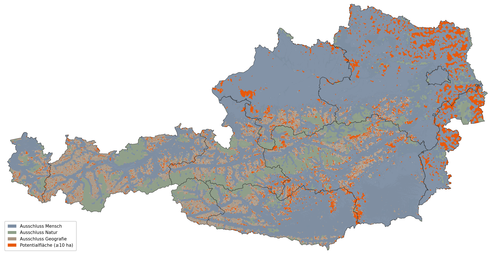
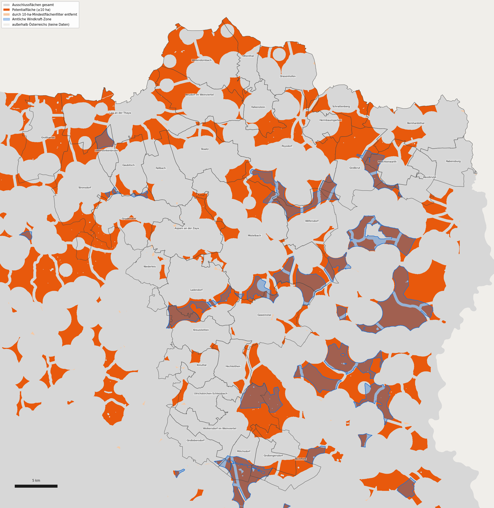

# Abschichtung Windkraft Österreich

Wo in Österreich könnte ein Windrad stehen? Dieses Repo beantwortet die
Frage durch **Abschichtung**: Von der Landesfläche werden nacheinander alle
Flächen abgezogen, auf denen Windkraft aus Gründen des Siedlungsschutzes,
des Naturschutzes oder der Geografie ausscheidet — Wohngebiete samt
Abstandspuffer, Schutzgebiete, steiles oder zu hoch gelegenes Gelände,
windschwache Lagen. Was übrig bleibt, ist die **Potentialfläche** — derzeit
rund 3 660 km², gut 4 % der Landesfläche.

Das Ergebnis ist ein GeoTIFF mit 44 Bändern in 25 m Auflösung (EPSG:31287):
jedes Ausschlusskriterium als eigene Maske, dazu die Summen je Familie und
die bereinigte Potentialfläche.



*Österreich gesamt — Ausschlüsse nach Familie (Mensch, Natur, Geografie),
darüber die verbleibende Potentialfläche.*



*Bezirk Mistelbach (NÖ) — berechnete Potentialfläche gegen die amtlich
ausgewiesenen Windkraftzonen. Die Zonen gehen nicht in die Berechnung ein;
sie laufen als Referenz mit, damit man sieht, wo beides zusammenfällt und
wo nicht.*

## Die Ausschlüsse

| Familie | Kriterium | Quelle | Regel |
|---|---|---|---|
| Mensch | Wohnbauland | Flächenwidmung der Länder | Puffer 1 000 m, NÖ 1 200 m |
| Mensch | Häuser im Grünen — Ferienhaus- und Tourismuswidmung, Streusiedlungen ab 5 Adressen, NÖ-Mindestabstandszonen | Widmung, Adressregister, OSM, NÖ SekROP | Puffer 750 m |
| Mensch | Gebäude allgemein, bewohnte Einzellagen, Nicht-Wohngebäude | Kataster (DKM), OSM | Fußabdruck, 25 m |
| Mensch | Seilbahngebäude | OSM | Puffer 50 m |
| Mensch | Autobahnen, Schnell-, Bundes- und Landesstraßen; Haupt- und Schmalspurbahnen; Personenseilbahnen | OSM, ohne Tunnel | Puffer 150 m |
| Mensch | Militärische Sperrgebiete | OSM | Fläche |
| Mensch | Hauptflughäfen samt An- und Abflugkorridor | OSM | Areal; Korridor 5 km, ±15° je Landebahn |
| Natur | Nationalparks, Naturschutz-, Europaschutz-, Ramsar-Gebiete; ergänzend Natura 2000 und Landschaftsschutz aus OSM | Schutzgebietskataster, OSM | Fläche, kein Puffer |
| Geografie | Hangneigung | Geländemodell 25 m | über 15° |
| Geografie | Höhenlage | Geländemodell 25 m | über 2 500 m |
| Geografie | Windhöffigkeit | Global Wind Atlas, 150 m Höhe | unter 150 W/m² |
| Geografie | Gewässer | OSM | ab 1 ha |

Die Vereinigung aller Kriterien ist `all_exclusions`. Was danach übrig
bleibt, wird um zusammenhängende Restflächen **unter 10 ha** bereinigt —
das ist die Potentialfläche, Band `available_cleaned_min_10ha`. Vier
zusätzlich geglättete Varianten (Gauß, σ 100 bis 300 m) zeigen, wie robust
eine Fläche gegen kleine Verschiebungen der Puffer ist.

Alle Abstände und Schwellwerte stehen in `config.json` und
`calc/abschichtung_common.py`; jedes Band ist in `out/abschichtung.bands.json`
beschrieben.

## Zum Laufen bringen

Voraussetzungen: Python ≥ 3.10 mit [uv](https://docs.astral.sh/uv/),
`osmium-tool` (`brew install osmium-tool`), rund 25 GB Plattenplatz.

```bash
uv sync                # Abhängigkeiten
# Rohdaten nach data/ — siehe "Datenquellen"
make check-guards      # Wächter: data/ wird nur gelesen
make                   # prep → layers → finalize → export
make test
```

Ein Kaltstart dauert rund eine Stunde, ein zweiter Lauf mit unveränderten
Eingaben wenige Minuten — die Kette merkt sich, was schon gerechnet ist.
Danach liegt unter `out/`:

| Datei | Inhalt |
|---|---|
| `abschichtung.tif` + `abschichtung.bands.json` | Das 44-Band-Raster und sein Manifest — nur zusammen weitergeben |
| `dashboard/index.html` | Kartenansicht aller Bänder (Leaflet über OSM) |
| `gemeinden.geojson` | Gemeindegrenzen im Rasterbezug |
| `wka_bestand_punkte.geojson` | Bestehende Windkraftanlagen aus OSM |
| `LAYER.md` | Bandbeschreibungen in lesbarer Form |

> ⚠️ **Fehlende Rohdaten führen nicht zum Abbruch.** Eine unvollständige
> `data/`-Kopie erzeugt ein plausibel aussehendes, aber falsches Ergebnis.
> Vor dem ersten Lauf [`docs/rohdaten.md`](docs/rohdaten.md), Abschnitt 0,
> lesen.

Betrieb, Wiederholbarkeit, Umgebungsvariablen, Tests und bekannte
Einschränkungen: [`docs/BETRIEB.md`](docs/BETRIEB.md).

## Datenquellen

`data/` ist nicht Teil des Repos (rund 13 GB). Provenienz, Bezugsweg und
Lizenz jeder einzelnen Datei stehen in [`docs/rohdaten.md`](docs/rohdaten.md).

| Quelle | Anbieter | Verwendung |
|---|---|---|
| Flächenwidmung, 9 Bundesländer | OGD-Portale der Länder | Wohnbauland, Häuser im Grünen |
| Digitale Katastralmappe (DKM) | BEV | Gebäudefußabdrücke |
| Adressregister | BEV | Streusiedlungen, Einzellagen |
| Verwaltungsgrenzen | BEV | Österreich-Maske, Gemeinden |
| Geländemodell 25 m | BEV | Hangneigung, Höhe, Rasterbezug |
| Windatlas, Leistungsdichte 150 m | Global Wind Atlas | Windhöffigkeit |
| Schutzgebiete | Umweltbundesamt | Naturschutz |
| NÖ SekROP Windkraft | Amt der NÖ Landesregierung | Mindestabstandszonen, Referenzzonen |
| OSM Österreich-Extrakt | Geofabrik | Straßen, Bahn, Seilbahnen, Gebäude, Gewässer, Militär, Flughäfen |

Direkt herunterladbar sind nur OSM und Windatlas; die übrigen Quellen
müssen manuell bei den jeweiligen Stellen bezogen werden. Belegte Lizenzen:
OSM unter ODbL, Flächenwidmung OÖ und Tirol unter CC-BY 4.0 — für die
übrigen Quellen ist die Lizenzlage in `rohdaten.md` als offen vermerkt und
vor jeder Weitergabe zu klären.

## Weiterführend

- [`docs/HANDOFF.md`](docs/HANDOFF.md) — Vertrag für alle, die das GeoTIFF
  weiterverarbeiten
- [`docs/BETRIEB.md`](docs/BETRIEB.md) — Kette im Detail, Wiederholbarkeit,
  Tests
- [`docs/dataflow/`](docs/dataflow/) — Datenfluss-Diagramm
