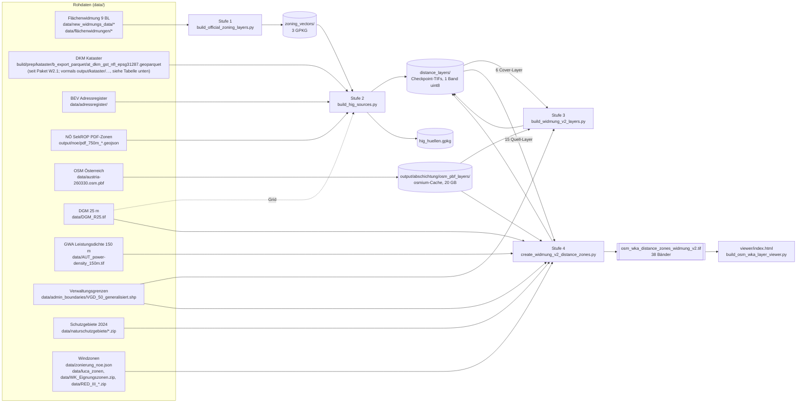

# Provenienz der Widmungs-Abschichtung v2

**Was dieses Dokument beantwortet:** Aus welchen Dateien, mit welchem Code und welchen
Parametern entsteht `output/abschichtung_widmung_v2/osm_wka_distance_zones_widmung_v2.tif`,
wo landen alle Zwischenprodukte, und woran erkennt man, ob der Stand auf der Platte
konsistent ist.

| | |
|---|---|
| Stand dieses Dokuments | 2026-08-21 (Code-Stand `b6c3a58`) |
| Dokumentiertes TIF | `output/abschichtung_widmung_v2/osm_wka_distance_zones_widmung_v2.tif`, 634 MB, geschrieben 2026-08-10 10:54, 38 Bänder |
| Band-Schema | `clean-38-ohne-wichtige-objekte-aug-2026` (`scripts/main/create_widmung_v2_distance_zones.py:127`) |
| Raster | EPSG:31287, 25 m, 14.001 × 24.001 Zellen, Bounds 99.987,5 / 249.987,5 – 700.012,5 / 600.012,5 (= Grid von `data/DGM_R25.tif`) |
| Reproduktion | `make widmung-v2` (vier Stufen + Validierung, mehrstündig) |
| Fachliche Doku der Bänder | `docs/README_osm_wka_distance_zones_widmung_v2.md` |

Dieses Dokument ergänzt die fachliche README um die **Datenherkunft**: es wurde durch
vollständiges Lesen der vier Stufen-Skripte und des gemeinsamen Moduls
`windkraft/calc/abschichtung_common.py` erstellt und jede Datei-Angabe gegen die Platte
geprüft (`ls`, `stat`, rasterio-Metadaten). Code-Stellen sind als `pfad:zeile` zitiert.

---

## 1. Datenfluss auf einen Blick



Lesart: Jede Stufe schreibt **Checkpoints** in `output/abschichtung_widmung_v2/distance_layers/`
und liest dort die Ergebnisse der Vorstufen. Stufe 4 komponiert daraus das finale TIF.
Das finale TIF wird **nie** gecacht – es wird bei jedem Lauf komplett neu zusammengesetzt.

---

## 2. Konsistenz des aktuellen Stands (Frische-Kette)

Die Warm-Checks der Pipeline prüfen **nicht** die Zeitstempel der Rohdaten (Details
in Abschnitt 8). Deshalb hier die Kette „wer ist jünger als wen" von Hand geprüft:

| Produkt | Zeitstempel | Erzeugt von | Konsistent? |
|---|---|---|---|
| Rohdaten Flächenwidmung (neueste: Wien) | 2026-07-29 | extern | – |
| `zoning_vectors/*.gpkg` (Stufe 1) | 2026-08-08 16:13 | Stufe 1 | ✔ jünger als alle Widmungs-Rohdaten |
| Stufe-2-Quellbänder (`official_settlement_source` … `hig_hulls_source`), `hig_huellen.gpkg` | 2026-08-06 21:16 | Stufe 2 | ⚠ **älter** als die Stufe-1-GPKGs. Inhaltlich trotzdem gültig: der Stufe-1-Code ist seit 05.08. unverändert und alle Rohdaten sind älter als 29.07., der 08.08.-Lauf hat also inhaltsgleiche GPKGs erzeugt. Nur der Zeitstempel ist „falsch herum". |
| Stufe-3-Gebäudebänder (`general_buildings_source`, `cableway_buildings_source`) | 2026-08-10 10:24 | Stufe 3 | ✔ Fingerprint-Tag = mtimes der 6 Cover-Layer, geprüft |
| Stufe-3-Infrastrukturbänder (`road_*`, `rail_main`, `cableway_people_150m`, `military_restricted_area`) | 2026-07-24 00:34 | Stufe 3 | ✔ Code und PBF seither unverändert (PBF 31.03.) |
| Stufe-3-Flughafenbänder | 2026-08-09 23:10 | Stufe 3 | ✔ |
| Stufe-4-Natur/Geographie/Zonierung | 2026-07-24 00:41 (Wasser 06.08.) | Stufe 4 | ✔ Inputs seither unverändert |
| Stufe-4-HiG-/Puffer-/WKA-Bänder | 2026-08-10 10:24–10:26 | Stufe 4 | ✔ `SOURCE_FINGERPRINT` = aktuelle mtimes der 15 Quell-Layer |
| **Finales TIF** | **2026-08-10 10:54** | Stufe 4 | ✔ jünger als alle 38 Quellbänder |
| Viewer `viewer/index.html` | 2026-08-10 09:35 | `build_osm_wka_layer_viewer.py` | ⚠ 80 Min. älter als das TIF; Bandzahl passt (38 ↔ 39 Layer), Schema unverändert → inhaltlich aktuell |

Zwei Punkte, die beim nächsten Lauf auffallen werden:

1. **`distance_layers/noe_pdf_hig_source.tif` fehlt.** Das Band wurde mit `e339f49`
   (10.08. 01:35) in Stufe 2 eingeführt, die Checkpoints stammen vom 06.08. Stufe 4 liest
   es nicht (nutzt weiter `noe_pdf_750m_zones`), das TIF ist also nicht betroffen. Aber:
   `make widmung-v2-hig` rechnet deshalb **alle** Stufen neu und schreibt nur das fehlende
   Band (`[keep]` für die 7 anderen). Wer die Stufe-2-Zeitstempel geraderücken will,
   braucht `--force-layers`.
2. **Das TIF ist `interleave=pixel`.** Der Compose-Lauf begann 10:26, der Band-Interleave-Fix
   (`d1a11e4`) wurde 10:43 committet. Nächster Lauf schreibt band-interleaved – Layout,
   nicht Inhalt.

---

## 3. Rohdaten-Inventar

Alle Pfade relativ zum Repo. „Stufe" = wo die Datei gelesen wird. Alle Dateien am
21.08.2026 auf der Platte vorhanden.

### 3.1 Amtliche Flächenwidmung (Stufe 1)

Die Auswahlregeln (welche Codes = Wohnbauland, Häuser im Grünen, Industrie) stehen
vollständig in `windkraft/calc/widmung_sources.py` (`DATASETS` Z. 57–125, `SOURCES`
Z. 235–351). `config.json` wird von Stufe 1 **nicht** gelesen.

| BL | Datei | Layer / Spalte | Wohnbauland (→ 1.000/1.200 m) | Häuser im Grünen (→ 750 m) | Industrie (Negativsignal) | Größe / Datum |
|---|---|---|---|---|---|---|
| Bgld | `data/flächenwidmungen/WIDMUNGSFLAECHEN.zip` | `BGLD_FLAECHENWIDMUNG` / `WIDCODE` | 10001, 10002, 10003, 10006, 10009, 10011, 10012, 10016, 10019 | Ferienhaus/Tourismus 10030, 10007, 10017 | 10004, 10005, 10015 | 50 MB, 22.06. |
| Ktn | `data/new_widmungs_data/kaernten/flawi_ktn_gpkg.zip` → entpackt nach `zoning_vectors/_cache/flawi_ktn_gpkg.gpkg` | `WIDG` / `WIDMUNG`, `WIDCODE`, `KATEGORIE` | Wohngebiet, Reines Wohngebiet; Misch: Dorfgebiet, Gemischtes Baugebiet, Geschäftsgebiet, Kurgebiet, Reines Kurgebiet | Hofstelle `WIDCODE` B2/B21/B22; Camping = Grünland ∧ Campingplatz | Industrie-, Gewerbe-, Reines Gewerbe-, Betriebsgebiet | ZIP 149 MB 12.07.; Cache 405 MB 23.07. |
| NÖ | `data/new_widmungs_data/niederoesterreich/RRU_WI_HUELLE.gpkg` | `WI_ART` | SBL, SBLNB (Wohn+Misch nicht trennbar) | Gho (Hofstelle), Gc (Camping), Gkg (Kleingarten) | **keiner** (BIB existiert, wird nicht genutzt) | 115 MB, 10.07. |
| OÖ | `data/new_widmungs_data/oberoesterreich/FLWI_WIDMUNGEN_F.zip!FLWI_WIDMUNGEN_F.shp` | `KENNZAHL` | 11005–11007, 11101–11106, 11201–11203; Misch 11001, 11002, 11009, 11010 | Hofstelle 13010/13020, Camping 13105, Golf 13107, Kleingarten 13201 | 11003, 11011 | 145 MB, 10.07. |
| Sbg | `data/new_widmungs_data/salzburg/Flaechenwidmung_Shapefile.zip!Flaechenwidmung/Flaechenwidmung.shp` | `Typname` | BAEW, BADG, BARW, BAKG, BALK, BAZG, BAFW | Camping GLCA, Kleingarten GLKG | BAGG, BAIG, BABG | 31 MB, 12.07. |
| Stmk | `data/new_widmungs_data/steiermark/Bauland.zip!Bauland.shp` | `GRUPPE_4` | wohn_Nutz; Misch gem_Nutz | – | betr_Nutz | 44 MB, 10.07. |
| Stmk | `data/flächenwidmungen/Flaewi.shp.zip` (EPSG:4258, 645k Features – einzige „alte" Quelle) | `FWP_NUTZ` / `WIDMUNG` | – | Auffüllungsgebiet (afg/AF*), Kleingarten (klg/Klg*), Camping (Ca*, L(SF-Ca)) | – | 961 MB, 22.06. |
| Tirol | `data/new_widmungs_data/tirol/FLW_Flaechenwidmung_*.gpkg` (Glob, erster Treffer; aktuell genau 1 Datei) | `FLW_Flaechenwidmung` / `WIDMUNG`, `FESTLEGUNG` | „Wohngebiet § 38", „Gemischtes Wohngebiet § 38", Kerngebiet § 40 (3), Allg./Landw. Mischgebiet | Tourismusgebiet § 40 (4); Hofstelle/Austraghaus (Regex); Camping/Golf über Sonderflächen + `FESTLEGUNG` | Gewerbe- u. Industriegebiet | 111 MB, 12.07. |
| Vbg | `data/new_widmungs_data/vorarlberg/fwp_flaeche.gpkg` | `fwp_flaeche` / `wi_em_txt` | Regex `^Bau(erwartungs)?fläche\s+(Wohngebiet\|Mischgebiet\|Kerngebiet)` | Camping/Golf/Kleingarten (Regex) | `…\s+Betriebsgebiet` | 151 MB, 12.07. |
| Wien | `data/new_widmungs_data/wien/genflwidmung_wien.geojson` (generalisierte Widmung, WFS GENFLWIDMUNGOGD; git-ignored) | `WIDMUNGSKLASSE_TXT`, `WIDMUNG_TXT` | startswith „Wohngebiet"; Misch `^Gemischtes Baugebiet(?!-Betriebsbaugebiet)` | Kleingarten in Gartensiedlungsgebiet | Industriegebiet, Gemischtes Baugebiet-Betriebsbaugebiet | 43 MB, 29.07. |

Seit `de7279a` (29.07.) ist Wien mit dabei – **alle 9 Bundesländer** sind amtlich
abgedeckt. (Der Docstring von `build_official_zoning_layers.py:6-12` sagt noch „8 BL /
Wien Vollausschluss" – veraltet.)

### 3.2 Bewohnt-Signale und Kataster (Stufe 2)

| Datei | Was | Genutzte Spalten / Filter | Größe / Datum |
|---|---|---|---|
| `output/kataster/at_dkm_gst_nfl_epsg31287.geoparquet` (Stand dieser Zeile: Vorgängerprojekt-Altlast, seit Paket W2.1 von keinem Codepfad mehr als Vorgabewert referenziert – siehe unten) | DKM-Nutzungsflächen ganz Österreich (selbst erzeugt aus BEV-DKM, siehe `scripts/kataster/`) | `source_layer ∈ {NFL_V2, NFL_DXF_POLYGONIZED}` ∧ (`ns ∈ {41, 52, 66, 71, …}` ∨ `ns_category ∈ {Baufläche, Garten}`); 41/66 = Gebäude, 52/71 = Garten (`windkraft/calc/kataster_layers.py:344-347`, `hig_detection.py:53-55,161-172`) | 5,3 GB, 15.05. |
| `build/prep/kataster/b_export_parquet/at_dkm_gst_nfl_epsg31287.geoparquet` (neuer Vorgabewert seit Paket W2.1, `pipeline/layers/hig.py` / `pipeline/prep/kataster/b_export_parquet.py`) | dieselben DKM-Nutzungsflächen, jetzt aus der Prep-Stufe (`pipeline/prep/kataster/`) statt aus der obigen Vorgängerprojekt-Datei – Flächensumme je Bundesland bis zur letzten Nachkommastelle deckungsgleich geprüft (Zeilenreihenfolge der Bundesländer unterscheidet sich) | dieselben Filter wie oben, unverändert | siehe `pipeline/prep/kataster/b_export_parquet.py` bzw. `build/prep/kataster/b_export_parquet/.fingerprint.json` für den aktuellen Stand |
| `data/adressregister/ADRESSE.csv` (+ Parquet-Cache `adressen_31287.parquet`) | BEV-Adressregister, Stichtag 1.10.2025, 2,52 Mio Adressen | `RW, HW, EPSG` (3 GK-Streifen → 31287), `#`-Koordinaten verworfen (`bev_register.py:88-95`) | 326 MB / 42 MB |
| `data/adressregister/…Stichtagsdaten_*.zip` → `GEBAEUDE.csv` (+ Cache `bev_gebaeude_31287.parquet`) | BEV-Gebäude mit `EIGENSCHAFT` | Wohnen = 01/02/03, Industrie = 08, Hotel 04 gilt **nicht** als Wohnen (`bev_register.py:55-60`) | 98 MB / 42 MB |
| `output/noe/pdf_750m_{geb,gwr,gruenland_widmung}.geojson` | NÖ SekROP Teil C 3.2, Zonen **inkl. 750 m** (aus PDF georeferenziert, `scripts/noe/`) | Vereinigung der drei Klassen | 8,3 / 8,0 / 1,4 MB, 23.07. |
| `output/noe/pdf_hig_source_{geb,gwr,gruenland_widmung}.geojson` | daraus rekonstruierte Quellobjekte (Erosion um 750 − 50 m, `windkraft/noe/pdf_hig_sources.py:34-35`) | → Band `noe_pdf_hig_source` (derzeit von niemandem gelesen) | 8,2 / 8,0 / 1,3 MB, 10.08. |

`output/noe/pdf_750m_*.geojson` setzt seinerseits `output/noe/alignment_mindestabstand.json`
voraus (die Affin-Georeferenzierung des GeoPDFs; gelesen u. a. von
`scripts/noe/extract_noe_vector_layers.py:259` ohne `.exists()`-Guard — fehlt sie, bricht
die Extraktion sofort ab). Seit Sept. 2026 ist diese Datei reproduzierbar:
`uv run python scripts/noe/align_pdf_shapefile.py` schreibt sie standardmäßig an genau
diesen Pfad (Abbruch, falls die Zieldatei schon existiert — `--overwrite` erzwingt es;
`--out <pfad>` für einen abweichenden Zielpfad). Die vier Eckkoordinaten stammen aus dem
`/GPTS`-Eintrag im `/Measure`-Dictionary des GeoPDFs
`data/nö_zonierung/TeilC_3_2_Karte_Mindestabstandszonen_A0_20240402.pdf` (verifizierbar per
`fitz.xref_object`) und liegen als benannte Konstante mit PDF-Rücklese-Funktion in
`windkraft/noe/pdf_align.py` (`GPTS_LATLON_MINDESTABSTAND`, `get_gpts_latlon_mindestabstand()`).
| `data/DGM_R25.tif` | nur als Grid-Template | – | 786 MB, 30.03. |

### 3.3 OpenStreetMap (Stufen 3 + 4)

| Datei | Was | Größe / Datum |
|---|---|---|
| `data/austria-260330.osm.pbf` | Geofabrik-Extrakt Österreich, Stand 30.03.2026 (CLI-Default `--osm-pbf`) | 797 MB, 31.03. |
| `output/abschichtung/osm_pbf_layers/` | osmium-Cache, **geteilt mit der OSM-Kette**. Schema: `clip_<sha1(pbf, wgs84-bbox)[:12]>.osm.pbf` (Clip auf Grid + 7 km) → `<clip>.osm_<layer>.osm.pbf` (tags-filter) → `<clip>.osm_<layer>.geojsonseq` (export) (`abschichtung_common.py:400-482`) | 20 GB, 75 Dateien |
| `data/austria-260328-free.shp/`, `data/osm_power_lines.gpkg` | Legacy-Shapefile-Fallback, nur wenn der PBF fehlt | 3,6 GB / 13 MB |

OSM-Layer, die in v2 tatsächlich verwendet werden (Filter = osmium-Syntax,
`abschichtung_common.py:327-354`; Spalten `:356-390`):

| Layer | osmium-Filter | Spalten | Stufe | Band(s) |
|---|---|---|---|---|
| `buildings` | `w/building r/building` | building | 3 | general_/cableway_buildings_source |
| `windpower` | `nwr/generator:source=wind nwr/man_made=wind_turbine` (`:219`) | power, generator:source, man_made, name | 3, 4 | WKA-Drop aus Gebäuden; wka_bestand_ausserhalb_zonen |
| `aerialways` | `n/aerialway w/aerialway r/aerialway` | aerialway | 3 | cableway_buildings_source (alle Typen, 100 m); cableway_people_150m (nur Personenbahnen) |
| `roads` | `w/highway` | highway, tunnel | 3 | road_motorway_trunk, road_federal_state |
| `railways` | `w/railway` | railway, tunnel | 3 | rail_main |
| `military` | `w/landuse=military r/landuse=military w/military r/military` | landuse, military | 3 | military_restricted_area |
| `transport` | `n/aeroway w/aeroway r/aeroway` | aeroway, id, @id | 3 | airport_area_major, airport_runway_corridor_5km |
| `nature` | `w\|r/boundary=protected_area`, `boundary=national_park`, `leisure=nature_reserve`, `protect_class`, `protection_title` | boundary, leisure, protect_class, protection_title, name | 4 | osm_nature_protection_areas |
| `water` | `w\|r/natural=water`, `waterway=riverbank`, `landuse=reservoir` | natural, water, waterway, landuse, name | 4 | geography_water_bodies |
| `powerlines` | `w/power=line w/power=minor_line` | power, voltage | 3 (gelesen, **verworfen**) | – (seit Clean-Schema kein Band) |

### 3.4 Geographie, Schutz, Grenzen, Zonierung (Stufe 4)

| Datei | Was | Config-Key / CLI | Größe / Datum |
|---|---|---|---|
| `data/DGM_R25.tif` | Höhenmodell 25 m; Grid-Template; Hangneigung (4×4-Block = 100 m, Sobel) und Höhe | `paths.dgm` | 786 MB, 30.03. |
| `data/AUT_power-density_150m.tif` | Global Wind Atlas Leistungsdichte 150 m, EPSG:4326, 0,0025° | `paths.wind_pd_150` | 7 MB, 29.03. |
| `data/admin_boundaries/VGD_Oesterreich_gen_50_20221002/VGD_50_generalisiert.shp` | Verwaltungsgrenzen generalisiert, 7.850 KG-Polygone, Spalte `BL` | `paths.vgd` | 17 MB, 2022 |
| `data/naturschutzgebiete/SG_AT_2024_v_April_Stand_3_April_2024.zip` → `SG_AT_2024_v_April.gpkg` | Layer `NP_AT_2024`, `NSG_AT_2024`, `ESG_AT_2024`, `RAMSAR_AT_2024` | `paths.nsg_zip`, `nsg_gpkg`, `nsg_layers` | 73 MB, 29.03. |
| `data/zonierung_noe.json` | NÖ Windkraft-Zonierung (SekROP), amtliche data.gv.at-Rohquelle, 71 Zonen, EPSG:4326 – **jetzt der Default** (Sep 2026), keine Abhängigkeit mehr zur Legacy-Webmap-Pipeline | `--official-zoning-geojson` | 600 KB, 30.04. |
| `data/luca_zonen/Stmk.shp`, `Sbg.shp` | Vorrangzonen Stmk (SAPRO) und Sbg | `--vorrangzonen-dir` | Juli |
| `data/WK_Eignungszonen.zip` | Bgld Eignungszonen (`Status` startswith „Eignungszone") | fest verdrahtet `wind_zones.py:69-100` | Juli |
| `data/RED_III_Windkraftbeschleunigungszone.zip` | Ktn RED-III-Beschleunigungszonen | fest verdrahtet | Juli |

### 3.5 `config.json` – was davon wirkt

`load_config()` (`windkraft/config.py:8-59`) macht 9 Pfad-Keys absolut und berechnet
`_derived`. Für v2 relevant:

| Key | Wert | Wirkt in | Hinweis |
|---|---|---|---|
| `paths.dgm`, `paths.wind_pd_150`, `paths.vgd`, `paths.nsg_*` | s. o. | Stufe 2–4 | |
| `exclusion.slope_max_deg` | 15 → `_derived.slope_threshold_pct` = 26,8 % | Band 23 | |
| `exclusion.elevation_max` | 2500 m | Band 24 | |
| `wind.pd_min` / `pd_min_height_m` / `shear_alpha` | 150 W/m² @ 130 m / 0,143 → `_derived.power_density_min_150` ≈ 159,5 W/m² | Band 25 | `_derived` entsteht nur via `load_config()`; die Builder hätten sonst 20° / 180 W/m² als Default (`abschichtung_common.py:1241,1251`) |
| `buffers.major_airport_osm_ids` | `[75732093, 29566108, 30266004, 30514270, 98446291, 282147138]` | Bänder 19/20 | IDs nicht gefunden → stiller Fallback auf die 6 größten Aerodrome |
| `buffers.settlement`, `buffers.individual_objects`, `raster.crs`, `raster.cellsize` | 1000/1200, 750, EPSG:31287, 25 | **wirkungslos** | In `abschichtung_common.py:58-80` als Konstanten dupliziert; Grid kommt aus dem DGM. Eine Änderung in config.json ändert v2 **nicht**. |

---

## 4. Stufe 1 – Amtliche Widmung bündeln

```
uv run python scripts/main/build_official_zoning_layers.py --out-dir output/abschichtung_widmung_v2/zoning_vectors
```

| | |
|---|---|
| Code | `scripts/main/build_official_zoning_layers.py` (137 Z.), Logik in `windkraft/calc/widmung_sources.py` |
| Input | die 10 Widmungsdateien aus 3.1 |
| Verarbeitung | je Datei ein Read mit nur den nötigen Spalten → `to_crs(31287)` → Features außerhalb `AT_BBOX = (100000, 250000, 700000, 600000)` verwerfen (`widmung_sources.py:45,429-436`; wegen ~10° verschobener Stmk-Features) → Prädikat-Masken (`values` / `startswith` / `contains`, `:462-482`). **Kein Dissolve, kein Puffer, kein Clip auf Landesgrenzen.** Leere Treffer → `[warn]`, kein Abbruch. |
| CLI | `--out-dir`, `--cache-dir` (Default `<out>/_cache`, nur Kärnten-Entpackung), `--bl` (wiederholbar), `--bucket` |
| Output | `zoning_vectors/wohn_misch_combined.gpkg` (Layer `wohn_misch`, 397.445 Flächen, 9 BL, 315 MB) · `haeuser_im_gruenen_combined.gpkg` (40.016 Flächen, Spalte `category` ∈ hofstelle/camping/golf/kleingarten/auffuellungsgebiet/ferienhaus_tourismus, 19 MB) · `industrie_negativ_combined.gpkg` (28.739 Flächen, 8 BL ohne NÖ, 24 MB) – alle EPSG:31287, Spalten `geometry, bundesland, source_layer, category` |
| Warm-Check | **keiner.** Jeder Lauf liest alles neu und überschreibt. Einzige Ausnahme: das entpackte Kärnten-GPKG wird nie gegen ein neueres ZIP geprüft. |

---

## 5. Stufe 2 – Häuser im Grünen / Bewohnt-Signal

```
uv run python scripts/main/build_hig_sources.py --zoning-dir output/abschichtung_widmung_v2/zoning_vectors --out-dir output/abschichtung_widmung_v2
```

| | |
|---|---|
| Code | `scripts/main/build_hig_sources.py` (261 Z.); `windkraft/calc/hig_source_masks.py`, `hig_detection.py`, `streusiedlung.py`, `bev_register.py`, `kataster_layers.py` (nur `ns_kind`, FFT-Dilatation) |
| Input | Stufe-1-GPKGs; DKM-Geoparquet; BEV Adressen + Gebäude; NÖ-PDF-GeoJSONs; DGM (Grid) |
| Parameter | `--filter-buffer-m 500` · `--chain-m 200` · `--min-adressen 5` · `--address-radius-m 100` · `--garden-radius-m 150` · `--max-footprint-m2 10000` · `--wohnanteil-min-share 0.1` · `--industrie-widmung-min-share 0.5` (Defaults = Konstanten `abschichtung_common.py:152-184`) |

Verarbeitung in drei Teilen:

**A – Kandidatenfilter** (`build_hig_sources.py:96-108`): `widmung_seed` = Wohnbauland ∪
HiG-Widmung ∪ Ferienhaus, per FFT um 500 m gepuffert, ∪ NÖ-PDF-Zonen. Bauflächen
**innerhalb** dieses Filters sind amtlich abgedeckt und werden hier nicht weiter
betrachtet; nur der Rest ist Kandidat für „Häuser im Grünen".

**B – DKM-Scan und Hüllen** (`hig_detection.py:134-267`): DKM-Bauflächen (Zentroid
außerhalb Filter) rastern; Footprints > 10.000 m² (NÖ-DXF-Artefakte, größter 735 ha) werden
durch eine 5-m-Scheibe am Zentroid ersetzt. Dann morphologisches Closing: Dilatation
100 m (= chain/2), Erosion 65 m (`streusiedlung.py:57,67-71`) → 8er-Nachbarschafts-Labeling
→ Hüllen. Keine Mindestgröße.

**C – Signale und Klassifikation** (`hig_detection.py:279-380`, cKDTree): je Baufläche
`has_address` (BEV-Adresse ≤ 100 m), `has_garden` (DKM-Garten ≤ 150 m), nächstes
BEV-Gebäude ≤ 100 m mit `EIGENSCHAFT`, `in_industrie_widmung`. Je Hülle:
`industriegebietartig` = (n_bev > 0 ∧ Wohnanteil < 0,1) ∨ (≥ 50 % der Gebäude in
Industriewidmung ∧ nicht BEV-wohnbelegt); `bewohnt` = (n_adressen > 0 ∨ n_garten > 0) ∧
¬industriell.

Zuordnung (`build_hig_sources.py:148-149`) – das ist die zentrale Policy-Entscheidung
der v2-Kette:

| Klasse | Bedingung | Band | Abstand in Stufe 4 |
|---|---|---|---|
| Streusiedlung | bewohnt ∧ n_adressen ≥ 5 | `hig_hulls_source` | 750 m |
| bewohnte Einzellage | bewohnt ∧ n_adressen < 5 | `bewohnt_einzellage_source` | 25 m (als Teil von `general_buildings`) |
| nicht bewohnt / industriell | sonst | `nonresidential_hulls_source` | 25 m |

**NÖ-Sonderweg:** In NÖ trägt die amtliche SekROP-PDF-Quelle (`noe_pdf_750m_zones`) den
750-m-Abstand. NÖ-Streusiedlungshüllen werden in Stufe 4 aus Band 5 wieder entfernt
(`create_widmung_v2_distance_zones.py:266-267`) und in Stufe 3 nur als 25-m-Footprint
geführt (`build_widmung_v2_layers.py:160-165`).

| Output (`distance_layers/`, uint8 0/1) | Inhalt | Stand |
|---|---|---|
| `official_settlement_source.tif` | amtliches Wohnbauland | 06.08. 21:16 |
| `ferienhaus_tourismus_source.tif` | Ferienhaus-/Tourismuswidmung (Bgld, Tirol) | 06.08. |
| `official_hig_source.tif` | HiG-Widmung ohne Ferienhaus | 06.08. |
| `noe_pdf_750m_zones.tif` | NÖ-Zonen inkl. 750 m | 06.08. |
| `noe_pdf_hig_source.tif` | NÖ-Quellobjekte (erodiert) | **fehlt** (Band neu seit 10.08.) |
| `hig_hulls_source.tif` | Streusiedlungs-Hüllen | 06.08. |
| `bewohnt_einzellage_source.tif` | bewohnte Hüllen < 5 Adressen | 06.08. |
| `nonresidential_hulls_source.tif` | industriell / unbewohnt | 06.08. |
| `output/abschichtung_widmung_v2/hig_huellen.gpkg` | 46.512 Hüllen mit allen Zählern (`n_adressen, n_garten, n_bev, n_wohn, wohnanteil, klasse, ist_streusiedlung, area_ha, bundesland`) – **das Audit-Produkt** für jede einzelne Hülle | 06.08., 23 MB |

Warm-Check: Band gilt als fertig, wenn TIF existiert, Grid passt und alle 9 Parameter-Tags
(`HIG_FILTER_BUFFER_M` … `HIG_ZONING_DIR`) übereinstimmen (`build_hig_sources.py:219-232`).
**Kein Fingerprint auf Stufe-1-GPKGs, DKM, BEV oder NÖ-Dateien.** Die BEV-Parquet-Caches
werden nie invalidiert.

---

## 6. Stufe 3 – OSM-Restschicht

```
uv run python scripts/main/build_widmung_v2_layers.py --layer-dir output/abschichtung_widmung_v2/distance_layers
```

| | |
|---|---|
| Code | `scripts/main/build_widmung_v2_layers.py` (259 Z.), Builder in `abschichtung_common.py` |
| Input | OSM-PBF via Cache (buildings, windpower, aerialways, roads, railways, military, transport); die 6 `OFFICIAL_COVER_LAYERS` aus Stufe 2 (`official_settlement_source, ferienhaus_tourismus_source, official_hig_source, noe_pdf_750m_zones, hig_hulls_source, bewohnt_einzellage_source` – Pflicht, sonst `FileNotFoundError` `:104-110`); VGD (nur NÖ-Maske); `buffers.major_airport_osm_ids` |
| CLI | `--layer-dir`, `--osm-pbf`, `--osm-pbf-cache-dir`, `--bbox`, `--force-layers`, `--skip-infra`; `--mode` und `--total-height-m` sind in v2 **wirkungslos** (alle Infra-Abstände fix 150 m) |

**Gebäudeklassifikation** (`build_osm_building_sources`, `:126-200`):

1. `covered_mask` = OR der 6 Cover-Layer – alles, was amtlich schon abgedeckt ist.
2. OSM-Gebäude laden; **Windräder entfernen** (geometrischer `sjoin` mit dem
   windpower-Layer, `drop_wind_power_buildings` `abschichtung_common.py:517-556`) – sonst
   würde eine Anlage mit `building=yes` ihren eigenen Repowering-Standort ausschließen.
3. Repräsentativpunkt je Gebäude → Zellabfrage in `covered_mask`.
4. `cableway_buildings_source` = nicht abgedeckt ∧ ≤ 100 m an irgendeiner Aerialway-Linie
   (`CABLEWAY_BUILDING_MATCH_RADIUS_M`, `:132`).
5. `general_buildings_source` = alle übrigen nicht abgedeckten OSM-Gebäude ∪ DKM-Fußabdrücke
   (`bewohnt_einzellage_source` österreichweit + `hig_hulls_source` ∧ NÖ).

**Infrastruktur** (`build_infrastructure_masks`, `:926-980`; je 150 m FFT-Dilatation,
`INFRA_RULES` `:263-270`): `road_motorway_trunk` (motorway/trunk + _link, ohne Tunnel),
`road_federal_state` (primary/secondary/tertiary + _link), `rail_main` (rail/narrow_gauge,
ohne Tunnel), `cableway_people_150m` (nur `PEOPLE_CARRYING_AERIALWAY_TYPES` `:240-251`),
`military_restricted_area` (Polygone, 0 m). `power_380_400kv` wird noch berechnet, aber
nicht geschrieben.

**Flughäfen** (`build_airport_corridor_masks`, `:1062-1116`): `airport_area_major` =
Aerodrome-Polygone der 6 Config-IDs; `airport_runway_corridor_5km` = je Bahnende ein
Kreissektor 5.000 m, ± 15° (Runways ≤ 300 m um das Areal, Achse ≥ 500 m; `:205-207`).

| Output (`distance_layers/`) | Stand |
|---|---|
| `cableway_buildings_source.tif`, `general_buildings_source.tif` | 10.08. 10:24 |
| `road_motorway_trunk.tif`, `road_federal_state.tif`, `rail_main.tif`, `cableway_people_150m.tif`, `military_restricted_area.tif` | 24.07. 00:34 |
| `airport_area_major.tif`, `airport_runway_corridor_5km.tif` | 09.08. 23:10 |

Warm-Check: Gebäudebänder tragen `HIG_SOURCE_FINGERPRINT` (= `name:mtime_ns` der 6
Cover-Layer, `:203-209`) und `BUILDING_CLASSIFICATION_REVISION = "5-wichtige-objekte-entfernt"`
(`abschichtung_common.py:225`) – ein Stufe-2-Neulauf invalidiert sie automatisch.
Infra- und Flughafenbänder haben **keinen** Fingerprint: ein neuer PBF oder geänderte
`INFRA_RULES` werden ohne `--force-layers` nicht wirksam.

---

## 7. Stufe 4 – Puffer, Geographie, Komposition

```
uv run python scripts/main/create_widmung_v2_distance_zones.py --layer-dir output/abschichtung_widmung_v2/distance_layers --output output/abschichtung_widmung_v2/osm_wka_distance_zones_widmung_v2.tif
```

| | |
|---|---|
| Code | `scripts/main/create_widmung_v2_distance_zones.py` (515 Z.); Builder `abschichtung_common.py`, Windzonen `windkraft/calc/wind_zones.py` |
| Input | 15 Pflicht-Checkpoints (`REQUIRED_SOURCE_LAYERS` `:206-222`: 6 aus Stufe 2, 9 aus Stufe 3); DGM; Leistungsdichte; VGD; Schutzgebiete-GPKG; OSM nature/water/windpower; NÖ-Zonierung; BL-Windzonen; config `exclusion.*`, `wind.*` |
| CLI | `--output`, `--layer-dir`, `--min-fragment-area-ha 10.0`, `--official-zoning-geojson`, `--vorrangzonen-dir data/luca_zonen`, `--vorrangzonen` (an), `--settlement-variants` (**aus**; 6 Varianten × 4 Bänder = +24), `--drop-human-band` (Sensitivität), `--osm-pbf`, `--osm-pbf-cache-dir`, `--force-layers`, `--skip-final`, `--no-overviews`, `--bbox` |

### 7.1 Die 38 Bänder

Typ: **A** = Ausschluss (fließt in `exclusion_*` und damit in `available`), **R** =
Referenz/Quelle (nur zum Nachvollziehen im TIF), **D** = abgeleitet.

| Nr | Band | Regel / Abstand | Typ | Herkunft |
|---|---|---|---|---|
| 1 | `official_settlement_source` | amtl. Wohn-/Misch-/Kern-/Dorfgebiet, 9 BL | R | Stufe 2 |
| 2 | `settlement_buffer` | um Band 1: **NÖ 1.200 m, sonst 1.000 m** (`SETTLEMENT_BUFFER_BY_BL` `abschichtung_common.py:58-68`), BL-weise via VGD | A | `:272` |
| 3 | `haeuser_im_gruenen_ferienhaus` | = `ferienhaus_tourismus_source` | R | `:259` |
| 4 | `haeuser_im_gruenen_widmung` | = `official_hig_source` **ohne NÖ** | R | `:260` |
| 5 | `haeuser_im_gruenen_streusiedlung` | = `hig_hulls_source` (≥ 5 Adressen, 200-m-Kette) **ohne NÖ** | R | `:261` |
| 6 | `haeuser_im_gruenen_noe_pdf` | = `noe_pdf_750m_zones` (enthält bereits 750 m) | R | `:262` |
| 7 | `haeuser_im_gruenen` | (3 ∪ 4 ∪ 5) + **750 m** (`HIG_FAMILY_BUFFER_M` `:198`) ∪ 6 ungepuffert | A | `:270` |
| 8 | `nonresidential_hulls_source` | industrielle / unbewohnte DKM-Hüllen | R | Stufe 2 |
| 9 | `nonresidential_hulls_buffer` | 8 + **25 m** (`:191`) | A | `:274` |
| 10 | `cableway_buildings_source` | OSM-Gebäude ≤ 100 m an Seilbahn | R | Stufe 3 |
| 11 | `cableway_buildings_buffer` | 10 + **50 m** (`:133`) | A | `:275` |
| 12 | `general_buildings_source` | übrige OSM-Gebäude + bewohnte Einzellagen + NÖ-Streusiedlungs-Footprints | R | Stufe 3 |
| 13 | `general_buildings_buffer` | 12 + **25 m** (`:86`) | A | `:276` |
| 14 | `road_motorway_trunk` | Autobahn/Schnellstraße **150 m**, Tunnel ausgenommen | A | Stufe 3 |
| 15 | `road_federal_state` | primary/secondary/tertiary **150 m** | A | Stufe 3 |
| 16 | `rail_main` | Bahn **150 m**, Tunnel ausgenommen | A | Stufe 3 |
| 17 | `cableway_people_150m` | Personen-Seilbahnen **150 m** | A | Stufe 3 |
| 18 | `military_restricted_area` | Fußabdruck militärischer Flächen | A | Stufe 3 |
| 19 | `airport_area_major` | Areal der 6 Hauptflughäfen | A | Stufe 3 |
| 20 | `airport_runway_corridor_5km` | 5 km ± 15° ab Bahnenden | A | Stufe 3 |
| 21 | `nature_protection_areas` | NP / NSG / Europaschutz / Ramsar, Fußabdruck | A | `abschichtung_common.py:1129` |
| 22 | `osm_nature_protection_areas` | OSM-Schutzgebiete (Regex Naturschutz/Natura 2000/… oder `protect_class` 1–5, `:1165-1190`) | A | `:1165` |
| 23 | `geography_slope_too_steep` | Hangneigung (100 m) > **26,8 %** (= 15°) | A | `:1219` |
| 24 | `geography_elevation_too_high` | DGM > **2.500 m** | A | `:1253` |
| 25 | `geography_wind_too_low` | GWA-PD150 < **159,5 W/m²** oder NoData | A | `:1254` |
| 26 | `geography_water_bodies` | OSM-Wasserflächen, zusammenhängend ≥ **1 ha** (`WATER_MIN_AREA_HA` `:284`) | A | `:1281` |
| 27 | `exclusion_human` | OR der `HUMAN_BANDS` (2, 7, 9, 11, 13, 14–20; `create_…:175-187`) ∧ Österreich | D | `:1570` |
| 28 | `exclusion_nature` | 21 ∪ 22 ∧ Österreich | D | `:1575` |
| 29 | `exclusion_geography` | 23–26 ∧ Österreich | D | `:1580` |
| 30 | `all_exclusions` | 27 ∪ 28 ∪ 29 | D | `:1582` |
| 31 | `available_after_all_exclusions_raw` | ¬30 ∧ Österreich | D | `:1583` |
| 32 | `available_cleaned_min_10ha` | 31, Komponenten ≥ **10 ha**, **4er-Nachbarschaft** (`min_area_filter` `:1319-1341`) | D | `:1584` |
| 33–36 | `available_blur_sigma_{100,200,250,300}m` | Gauß auf Band 31 (raw), σ in Metern, uint8 0–100 | D | `:1592-1600` |
| 37 | `official_wind_zoning` | NÖ-Zonierung ∪ Stmk/Sbg Vorrang ∪ Bgld Eignung ∪ Ktn RED III, je Quelle auf das BL geclippt | R | `:1293` |
| 38 | `wka_bestand_ausserhalb_zonen` | OSM-Windräder in Österreich außerhalb Band 37 → Cluster 750 m → konvexe Hülle + 200 m | R | `create_…:299-335` |

`--drop-human-band <name>` nimmt ein Band aus `HUMAN_BANDS` heraus (Sensitivität); das
Band bleibt im TIF.

**Zusammensetzung Band 37** (396,18 km² Rasterfläche gesamt): Niederösterreich 71 Features
/ 280,72 km² aus `data/zonierung_noe.json`, Steiermark 17 Zonen / 46,1 km², Salzburg 13 /
17,1 km², Burgenland 40 / 24,7 km², Kärnten 4 / 7,4 km². Die Differenz zwischen der Summe
der Vektorflächen (376,0 km²) und der Rasterfläche (396,18 km²) ist Rasterisierungseffekt
bei 25 m Zellgröße.

**Lesehinweis Band 38, unbedingt vor Weiterverwendung der Zahl beachten:** Der Pipeline-Lauf
vom 04.09.2026 meldet `turbinen=1.595, in Österreich=1.595, in amtlicher Zone=807,
außerhalb=788` sowie `183 Park-Hüllen um 788 Anlagen`; Band 38 selbst umfasst 276.218 Zellen
bzw. 172,64 km². Die Zahl 788 ist technisch korrekt, vermengt aber drei verschiedene
Sachverhalte und darf nicht ungeprüft als „788 Anlagen stehen außerhalb ausgewiesener Zonen"
zitiert werden. Aufschlüsselung nach Bundesland (gegen Band 37 desselben TIF-Standes, Summen
exakt reproduziert):

| Bundesland | Anlagen | in Zone | außerhalb |
|---|---|---|---|
| Niederösterreich | 865 | 644 | 221 |
| Burgenland | 495 | 35 | 460 |
| Steiermark | 142 | 120 | 22 |
| Oberösterreich | 66 | 0 | 66 |
| Kärnten | 11 | 8 | 3 |
| Wien | 11 | 0 | 11 |
| Salzburg | 2 | 0 | 2 |
| Tirol | 2 | 0 | 2 |
| Vorarlberg | 1 | 0 | 1 |
| Summe | 1.595 | 807 | 788 |

Die drei Anteile:

- 80 Anlagen (Oberösterreich, Wien, Tirol, Vorarlberg) sind ein Registry-Artefakt: Diese vier
  Bundesländer haben gar keinen Eintrag in `WIND_ZONE_SOURCES`
  (`windkraft/calc/wind_zones.py:81-122`), dort zählt also jede Anlage automatisch als
  außerhalb. Ob diese Länder tatsächlich keine amtlichen Positivzonen führen, ist offen.
- 460 Anlagen entfallen auf Burgenland. Das ist kein Filterartefakt: `data/WK_Eignungszonen.zip`
  enthält nur zwei Status-Ausprägungen, „Eignungszone gem. Verordnung" (40 Zonen, 24,69 km²)
  und „Ausschlusszone gem. Verordnung" (31 Zonen, 16,60 km²); Bestandszonen gibt es dort nicht.
  435 der 495 Burgenland-Anlagen liegen außerhalb jedes Polygons dieser Datei. Die Verordnung
  umfasst insgesamt nur 41 km² und bildet den historisch gewachsenen, überwiegend älteren
  Anlagenbestand nicht ab. Nebenbefund: 27 Bestandsanlagen liegen in Flächen, die heute als
  Ausschlusszone ausgewiesen sind.
- 248 Anlagen (NÖ 221, Stmk 22, Ktn 3, Sbg 2) liegen in Bundesländern mit ausgebauter
  Zonenkulisse. Nur dieser Anteil trägt die Aussage „steht außerhalb ausgewiesener Flächen" im
  gemeinten Sinn.

### 7.2 Komposition und Raster-Profil

`compose_exclusion_geotiff` (`abschichtung_common.py:1494-1625`) streamt die Bänder
einzeln (~300 MB je Band) und OR-t sie in die drei Gruppen. **Die Aggregate 27–36 werden
mit `valid_area` (VGD-Rasterung) auf Österreich geschnitten; die Einzelbänder 1–26 und 37
laufen über die volle Bounding Box** (inkl. Puffer aus Nachbarländern). Wer Einzelbänder
auswertet, muss selbst maskieren. Band 38 ist de facto auf Österreich beschränkt
(Punktfilter `in_austria`).

Profil (`output_profile` `:1447-1469`): GTiff, uint8, nodata 0 (= „nicht ausgeschlossen",
kein echtes NoData), deflate, tiled 256², `interleave=band` (seit `d1a11e4`), Overviews
2/4/8/16 nearest. Kein Sidecar-JSON, kein Logfile – alle Zähler nur auf stdout.

**Das TIF ist selbstbeschreibend.** Stufe 4 schreibt alle Parameter als globale GeoTIFF-Tags
(`create_…:425-459`); `gdalinfo` bzw. `rasterio.open(...).tags()` zeigt sie. Auf dem
aktuellen TIF geprüft:

| Tag | Wert |
|---|---|
| `PIPELINE` / `BAND_SCHEMA` / `DISTANCE_ENGINE` | `widmung_v2` / `clean-38-ohne-wichtige-objekte-aug-2026` / `fft` |
| `SETTLEMENT_BUFFER_BY_BL` | JSON je Bundesland (NÖ 1200, sonst 1000) |
| `HIG_FAMILY_BUFFER_M` / `HIG_CHAIN_M` / `HIG_MIN_ADRESSEN` | 750 / 200 / 5 |
| `GENERAL_BUILDING_BUFFER_M` / `NONRESIDENTIAL_HULL_BUFFER_M` / `CABLEWAY_BUILDING_BUFFER_M` | 25 / 25 / 50 |
| `AIRPORT_CORRIDOR_LENGTH_M` / `AIRPORT_CORRIDOR_HALF_ANGLE_DEG` | 5000 / 15 |
| `WATER_MIN_AREA_HA` / `MIN_FRAGMENT_AREA_HA` | 1 / 10 |
| `UNCERTAINTY_BLUR_SIGMAS_M` / `UNCERTAINTY_BLUR_SOURCE` | 100,200,250,300 / `available_after_all_exclusions_raw` |
| `WKA_CLUSTER_CHAIN_M` / `WKA_HULL_MARGIN_M` | 750 / 200 |
| `DROPPED_HUMAN_BANDS` / `SETTLEMENT_BUFFER_VARIANTS` | `keine` / `{}` |
| `HIG_SOURCE`, `WIEN`, `WICHTIGE_OBJEKTE`, `BEWOHNTE_EINZELLAGEN`, `POWER_LINES` | Klartext-Notizen zur Policy (Quelle, Wien-Regel, Clean-Schema-Änderungen) |

Was **nicht** im TIF steht: die Zeitstempel/Hashes der Rohdaten (PBF-Stand, Widmungs-Stand,
DKM-Stand). Die lassen sich nur über dieses Dokument bzw. die Checkpoint-Fingerprints
rekonstruieren.

### 7.3 Outputs

| Datei | Inhalt | Stand |
|---|---|---|
| `output/abschichtung_widmung_v2/osm_wka_distance_zones_widmung_v2.tif` | 38 Bänder (rasterio: count 38, Beschreibungen = Code, Band-Tags `GAUSS_SIGMA_M/UNIT/SOURCE` auf 33–36) | 10.08. 10:54, 634 MB |
| `distance_layers/haeuser_im_gruenen_{ferienhaus,widmung,streusiedlung,noe_pdf}.tif`, `haeuser_im_gruenen.tif`, `settlement_buffer.tif`, `*_buffer.tif` | HiG-Familie und Puffer | 10.08. 10:25–10:26 |
| `distance_layers/nature_protection_areas.tif`, `osm_nature_protection_areas.tif`, `geography_*.tif`, `official_wind_zoning.tif` | Natur/Geographie/Zonierung | 24.07. (Wasser 06.08.) |
| `distance_layers/wka_bestand_ausserhalb_zonen.tif` | WKA-Bestand | 10.08. 10:24 |
| `output/abschichtung_widmung_v2/osm_wka_distance_zones_widmung_v2_ohne_380kv.tif` | älterer Sensitivitätslauf (`--drop-human-band power_380_400kv`, altes Schema) | 24.07., 466 MB |
| `output/abschichtung_widmung_v2/viewer/` | Leaflet-Viewer (`make widmung-v2-viewer`) | 10.08. 09:35 |

---

## 8. Warm-Check-Matrix: was invalidiert was?

Alle Checkpoints gehen durch `ensure_group_layers` (`abschichtung_common.py:1419-1444`):
ein Band gilt als fertig, wenn die Datei existiert, Grid/CRS/Transform passen, die
Band-Beschreibung dem Namen entspricht und – falls definiert – die Tags stimmen. Fehlt
**ein** Band einer Gruppe, wird die **ganze Gruppe** neu gerechnet, vorhandene gültige
Bänder aber mit `[keep]` **nicht** überschrieben.

| Gruppe | Stufe | Zusätzliche Gültigkeits-Tags | Wird automatisch ungültig bei … | Wird **nicht** erkannt |
|---|---|---|---|---|
| Stufe-1-GPKGs | 1 | – (kein Warm-Check, immer neu) | jedem Lauf | – |
| HiG-Quellbänder | 2 | 9 HiG-Parameter + `HIG_ZONING_DIR` | Parameteränderung, anderer zoning-dir | neue Widmungs-GPKGs, neue DKM/BEV/NÖ-Dateien |
| Gebäudebänder | 3 | `HIG_SOURCE_FINGERPRINT` (mtimes der 6 Cover-Layer), `BUILDING_CLASSIFICATION_REVISION` | Stufe-2-Neulauf, Revision-Bump | neuer OSM-PBF |
| Infra, Flughäfen | 3 | – | nur `--force-layers` | neuer PBF, geänderte `INFRA_RULES`, andere Airport-IDs |
| HiG-Familie, Puffer | 4 | `SOURCE_FINGERPRINT` (mtimes der 15 Quell-Layer), `BAND_SCHEMA`, Pufferdistanzen | Stufe-2/3-Neulauf, Schema-Bump, Distanzänderung | – |
| WKA-Bestand | 4 | `BAND_SCHEMA`, `WKA_PARAMS` (chain, margin, mtime `official_wind_zoning`) | Zonierungs-Neubau | neuer PBF |
| Natur, Geographie, Wasser, Zonierung | 4 | – | nur `--force-layers` | neue NSG-ZIP, neues DGM/PD-Raster, geänderte `exclusion.*`/`wind.*`, neue Zonen-Shapes, neue NÖ-Zonierung |
| Finales TIF | 4 | nie gecacht | jedem Lauf (außer `--skip-final`) | – |
| OSM-Cache | 3/4 | – | `mtime(cache) < mtime(PBF)` | geänderte `OSM_PBF_FILTERS` / `INCLUDE_TAGS` (kein Filter-Hash) |

**Faustregel:** Nach einem neuen PBF, neuen Schutzgebieten, neuem DGM oder geänderten
config-Schwellen immer `--force-layers` auf Stufe 3 und 4. Nach neuen Widmungsdaten
`--force-layers` auf Stufe 2 (Stufe 3/4 folgen dann automatisch über die Fingerprints).

---

## 9. Befunde für die Nachvollziehbarkeit

Beim Lesen des Codes aufgefallen, sortiert nach Relevanz. Nichts davon macht das
aktuelle TIF falsch; es sind Stellen, an denen ein künftiger Lauf still vom erwarteten
Verhalten abweichen kann.

**Stille Fallbacks (Lauf endet ohne Fehler, Ergebnis ist anders als gedacht)**

- Fehlt die Schutzgebiete-ZIP oder ein Layer darin → leeres Band 21, nur `print`-Warnung (`abschichtung_common.py:1135,1158`).
- Fehlt DGM oder Leistungsdichte-TIF → NaN-Raster → `geography_wind_too_low` ist **überall True** (`:1202-1204,1254`).
- Fehlt die VGD → `valid_area` = alles True, kein Österreich-Clip (`:1124`).
- Fehlt der OSM-PBF → `windpower`/`aerialways`/`military` werden leer: kein WKA-Drop aus den Gebäuden, keine Liftgebäude, kein Militär (`:441-452`).
- `major_airport_osm_ids` nicht im OSM-Extrakt → die 6 größten Aerodrome-Flächen (`:1087-1091`).
- Fehlende NÖ-Zonierung und fehlende Zonen-Shapes → Band 37 leer, nur `[warn]` (`:1302-1305`, `wind_zones.py:165`).
- Fehlt die Spalte `category` im HiG-GPKG → kein Ferienhaus-Band, alles landet in `official_hig_source` (`hig_source_masks.py:44-48`).

**Externe Abhängigkeiten**

- `osmium` (CLI, `/opt/homebrew/bin/osmium` 1.19.1) muss im PATH sein, sonst `FileNotFoundError` beim ersten Cache-Miss.
- Band 37 hängt per Default (seit Sep 2026) an `data/zonierung_noe.json` – der amtlichen data.gv.at-Rohquelle (71 NÖ-Zonen). `output/webmap_export/windkraft_export_v1/vector/official_zoning.geojson` war nur eine 1:1-Attribut-Ableitung derselben 71 Features (`export_visualizer_bundle.py::export_official_zoning`), nicht umgekehrt; die Abhängigkeit von der Legacy-Webmap-Pipeline ist damit entfernt, der alte Pfad bleibt per `--official-zoning-geojson`-Flag optional weiter nutzbar. **Achtung Checkpoint:** `layer_done()` prüft keinen Fingerprint der Eingabedatei – ein vor dieser Umstellung erzeugter `official_wind_zoning.tif`-Checkpoint wird beim nächsten Lauf stillschweigend wiederverwendet, nur `--force-layers` erzwingt einen Neubau (in diesem Fall unkritisch, da beide Dateien geometrisch identisch sind – s. Verifikation Sep 2026, 71 Features, gleiche Bounds/Fläche).
- `--vorrangzonen-dir` steuert nur Stmk + Sbg; Bgld und Ktn kommen aus fest verdrahteten `data/*.zip`-Pfaden (`wind_zones.py:69-100`).
- Der OSM-Cache wird mit der OSM-Kette (`output/abschichtung/`) geteilt; er enthält Alt-Schema-Stems (8 Hex) und neue (12 Hex) nebeneinander, ~7 GB byteidentische Duplikate von `buildings.geojsonseq`, gesamt 20 GB.

**Parameter, die nicht dort wirken, wo man sie erwartet**

- `buffers.settlement`, `buffers.individual_objects`, `raster.crs`, `raster.cellsize` in `config.json` werden von v2 ignoriert (Konstanten in `abschichtung_common.py:58-80`, Grid aus DGM).
- `--mode` / `--total-height-m` von Stufe 3 sind Totparameter.
- `_derived` (Slope-%, PD-Schwelle bei 150 m) existiert nur nach `load_config()`; wer die Builder direkt mit einer rohen JSON aufruft, bekommt andere Defaults.

**Fachliche Lücken**

- NÖ hat keinen `industrie_negativ`-Eintrag, obwohl `WI_ART = BIB` (Bauland Industriegebiet, 5.070 Flächen) existiert → in NÖ kann eine Industrie-Gebäudehülle als „bewohnt" (750 m) klassifiziert werden, wenn BEV-Adressen dranhängen.
- Die Cover-Abfrage in Stufe 3 ist punktbasiert (Repräsentativpunkt): ein großes Gebäude am Rand einer amtlichen Fläche zählt ganz oder gar nicht.
- Stufe 2 arbeitet auf DKM-Bauflächen, nicht auf BEV-Gebäuden; BEV ist nur Punktsignal ≤ 100 m.

**Altlasten im `distance_layers/`-Ordner** (werden von keiner Stufe mehr gelesen, harmlos):
`airport_area.tif`, `airport_lateral_check_6km.tif`, `power_380_400kv.tif`, `wien_full_exclusion.tif`,
`important_objects_source.tif`, `important_objects_buffer.tif`, `haeuser_im_gruenen_wichtige_objekte.tif`,
`haeuser_im_gruenen_v2_buffer.tif`, `settlement_v2_buffer*.tif`, `ferienhaus_tourismus_buffer.tif`,
`bewohnt_einzellage_buffer.tif`.

**Veraltete Docstrings:** `build_official_zoning_layers.py:6-12` („8 BL, Wien Vollausschluss"),
`hig_detection.py:10` (75/40 m statt 100/65 m).

---

## 10. Parameter-Register

Alle Distanzen und Schwellen der v2-Kette an einer Stelle (Werte = Code-Stand `b6c3a58`).

| Konstante | Wert | Stelle | Wirkt in |
|---|---|---|---|
| `TARGET_CRS` | EPSG:31287 | `abschichtung_common.py:39` | alles |
| Zellgröße / Grid | 25 m, aus `data/DGM_R25.tif` | `:306-321` | alles |
| `AT_BBOX` | (100000, 250000, 700000, 600000) | `widmung_sources.py:45` | Stufe 1 |
| `SETTLEMENT_BUFFER_BY_BL` | 1.000 m, NÖ 1.200 m | `abschichtung_common.py:58-68` | Band 2 |
| `HIG_FAMILY_BUFFER_M` | 750 m | `:198` | Band 7 |
| `HIG_FILTER_BUFFER_M` | 500 m | `:152-184` | Stufe 2 Kandidatenfilter |
| `HIG_CHAIN_M` | 200 m (Closing 100 / 65 m) | `:158`, `streusiedlung.py:57,67-71` | Stufe 2 Hüllen |
| `HIG_MIN_ADRESSEN` | 5 | `:166` | Streusiedlung vs. Einzellage |
| `HIG_ADDRESS_RADIUS_M` / `HIG_GARDEN_RADIUS_M` | 100 m / 150 m | `:152-184` | Bewohnt-Signal |
| `HIG_MAX_FOOTPRINT_M2` | 10.000 m² | `:152-184` | DXF-Artefakt-Filter |
| `HIG_WOHNANTEIL_MIN_SHARE` / `HIG_INDUSTRIE_WIDMUNG_MIN_SHARE` | 0,1 / 0,5 | `:152-184` | industriell-Regel |
| `GENERAL_BUILDING_BUFFER_M`, `BEWOHNT_EINZELLAGE_BUFFER_M`, `NONRESIDENTIAL_HULL_BUFFER_M` | 25 m | `:86,167,191` | Bänder 9, 13 |
| `CABLEWAY_BUILDING_MATCH_RADIUS_M` / `_BUFFER_M` | 100 m / 50 m | `:132-133` | Bänder 10, 11 |
| `INFRA_RULES` | 150 m, Tunnel ausgenommen | `:263-270` | Bänder 14–17 |
| `AIRPORT_CORRIDOR_LENGTH_M` / `HALF_ANGLE_DEG` / `RUNWAY_MIN_LENGTH_M` | 5.000 m / 15° / 500 m | `:205-207` | Band 20 |
| `exclusion.slope_max_deg` | 15° → 26,8 % | `config.json` | Band 23 |
| `exclusion.elevation_max` | 2.500 m | `config.json` | Band 24 |
| `wind.pd_min` | 150 W/m² @ 130 m → 159,5 @ 150 m | `config.json`, `config.py:33-36` | Band 25 |
| `WATER_MIN_AREA_HA` | 1 ha | `:284` | Band 26 |
| `--min-fragment-area-ha` | 10 ha, 4er-Nachbarschaft | `create_…:362`, `abschichtung_common.py:1319-1341` | Band 32 |
| `UNCERTAINTY_BLUR_SIGMAS_M` | 100 / 200 / 250 / 300 m | `:1344` | Bänder 33–36 |
| `WKA_CLUSTER_CHAIN_M` / `WKA_HULL_MARGIN_M` | 750 m / 200 m | `create_…:135-136` | Band 38 |
| `BAND_SCHEMA` | `clean-38-ohne-wichtige-objekte-aug-2026` | `create_…:127` | Cache-Gültigkeit Stufe 4 |
| `BUILDING_CLASSIFICATION_REVISION` | `5-wichtige-objekte-entfernt` | `abschichtung_common.py:225` | Cache-Gültigkeit Stufe 3 |

---

## 11. Reproduktion

```bash
# Gesamte Kette (Warm-Checks aktiv, nur Fehlendes wird gerechnet)
make widmung-v2

# Einzelne Stufen
make widmung-v2-zoning     # Stufe 1 – immer komplett neu
make widmung-v2-hig        # Stufe 2
make widmung-v2-osm        # Stufe 3
make widmung-v2-tif        # Stufe 4 – finales TIF immer neu komponiert
make widmung-v2-validate   # Testpunkte gegen das TIF (scripts/analysis/validate_hig_v2.py)
make widmung-v2-viewer     # Leaflet-Viewer nach output/abschichtung_widmung_v2/viewer/

# Alles von Grund auf (nach neuem PBF / neuen Rohdaten)
uv run python scripts/main/build_hig_sources.py --zoning-dir output/abschichtung_widmung_v2/zoning_vectors --out-dir output/abschichtung_widmung_v2 --force-layers
uv run python scripts/main/build_widmung_v2_layers.py --layer-dir output/abschichtung_widmung_v2/distance_layers --force-layers
uv run python scripts/main/create_widmung_v2_distance_zones.py --layer-dir output/abschichtung_widmung_v2/distance_layers --output output/abschichtung_widmung_v2/osm_wka_distance_zones_widmung_v2.tif --force-layers
```

Prüfen, ob ein TIF zu diesem Dokument passt:

```bash
uv run python -c "
import rasterio
s = rasterio.open('output/abschichtung_widmung_v2/osm_wka_distance_zones_widmung_v2.tif')
print(s.count, s.crs, s.res, s.shape, s.profile.get('interleave'))
print(s.tags().get('BAND_SCHEMA'))
for i, d in enumerate(s.descriptions, 1): print(i, d)
"
```
